# Hi, I'm Seagull / Merlin

I build [Magic](https://github.com/Merlin218/magic) and small tools around AI workflows, frontend productivity, and developer experience.

Most of my recent work is about making AI products feel usable in real workflows: edit, preview, save, export, publish, recover, then keep iterating until the rough edges disappear.

## Focus

- Magic: AI productivity surfaces, rich editors, file previews, self-media workflows, and agent-facing contracts.
- Tiny tools: VS Code/Cursor helpers, Vite plugins, VuePress plugins, and automation scripts that remove repetitive work.
- Product engineering: small UI details, reliable state transitions, and workflow feedback that makes the next action obvious.

## Projects

- [magic](https://github.com/Merlin218/magic) - Open-source all-in-one AI productivity platform.
- [vscode-extension-command-dock](https://github.com/Merlin218/vscode-extension-command-dock) - Custom terminal command buttons for VS Code/Cursor.
- [vite-plugin-antd-style-px-to-rem](https://github.com/Merlin218/vite-plugin-antd-style-px-to-rem) - Responsive px-to-rem conversion for `antd-style`.
- [vuepress-plugin-auto-navbar](https://github.com/Merlin218/vuepress-plugin-auto-navbar) - Automatic navbar generation for VuePress.

## Links

[Blog](https://blog.merlin218.top) · [Juejin](https://juejin.cn/user/1847596772237719) · [Email](mailto:863176846@qq.com)

